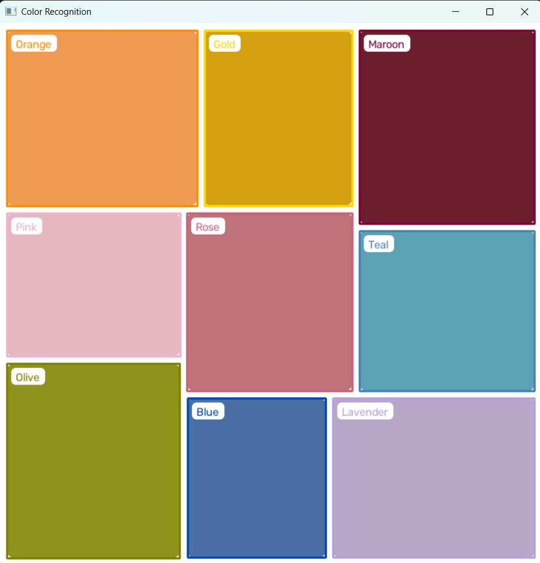

# color-recognition-opencv 🎨
A simple OpenCV project that detects and labels multiple colors in an image using HSV color ranges.

A Python project using OpenCV that detects multiple colors in an image and labels each one on top of it.

## 🎯 Task
This project does **Color Recognition**, one of the tasks from the OpenCV list, using a custom image with 9 different colors.

## 🖼️ Original Image

## ⚙️ How It Works
1. Convert the image from BGR to HSV, since it's easier to work with colors this way.
2. For each color, set an HSV range and create a mask that isolates just that color.
3. Clean up the mask using erosion and dilation to remove small noise.
4. Find contours and draw a box around areas big enough to count.
5. Add the color name above each box with a white background so it's readable on any color.

## 🧠 Challenge
Some colors like Pink, Rose, and Lavender were close to each other, so detection wasn't perfect at first. Also the text was hard to read on light colors, so I added a white background behind each label to fix that.

## 📸 Result

## 🛠️ How to Run

1. Create and activate a conda environment:

    conda create -n colorproject python=3.10
    conda activate colorproject

2. Install the libraries:

    pip install opencv-python numpy

3. Put your image in the project folder and name it `colors.jpg`.

4. Run the script:

    python color_recognition.py

## 📂 Files

- `color_recognition.py` — the code
- `colors.jpg` — original image
- `output.png` — result after detection
- `README.md` — this file

## 🧰 Tools Used
- Python 3.10
- OpenCV
- NumPy
- Anaconda
- Visual Studio Code
